# Lab-Report-1-Week-2

## Part 0: Introduction
The topic for lab1 is is Remote Access and Filesystem. \
Basically I set my computer up for remote access to the CSE lab computers and practiced with commands on terminal that work with the filesystem.

## Part 1: Install Visual Studio Code
* Download [Visual Studio Code](https://code.visualstudio.com/)

* Choose the version for your operating system (Mine is Mac) 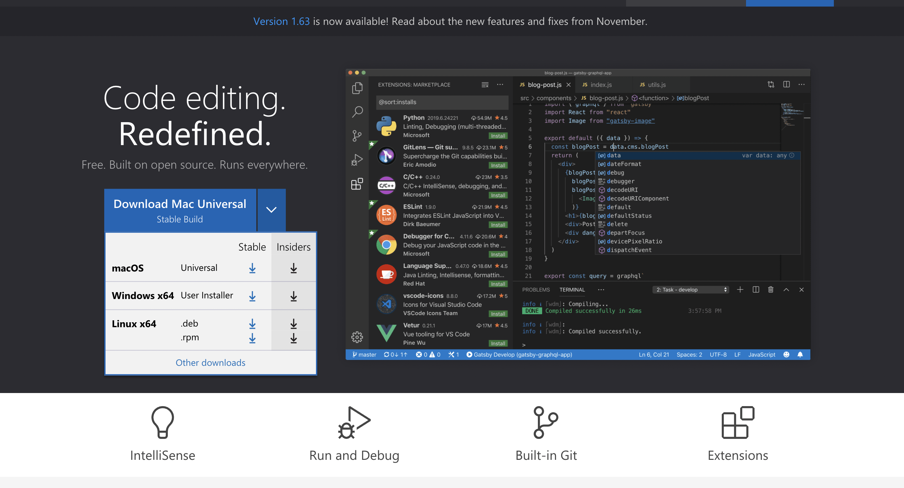

* After installation, VS code interface looked like this 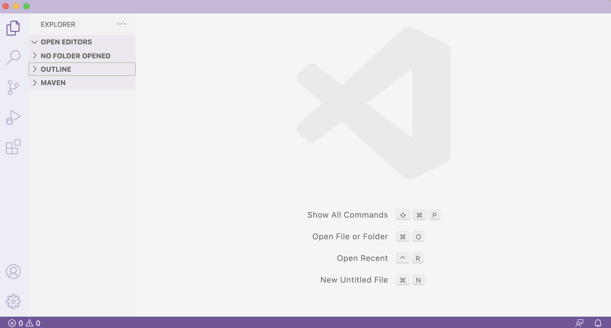

## Part 2: Remotely Connecting
* I opened a terminal in VS code and typed in following command to connect to the remote server: `ssh cs15lwi22ags@ieng6.ucsd.edu`

* Then I typed in the password of my course account

* After logging in, I saw the following output 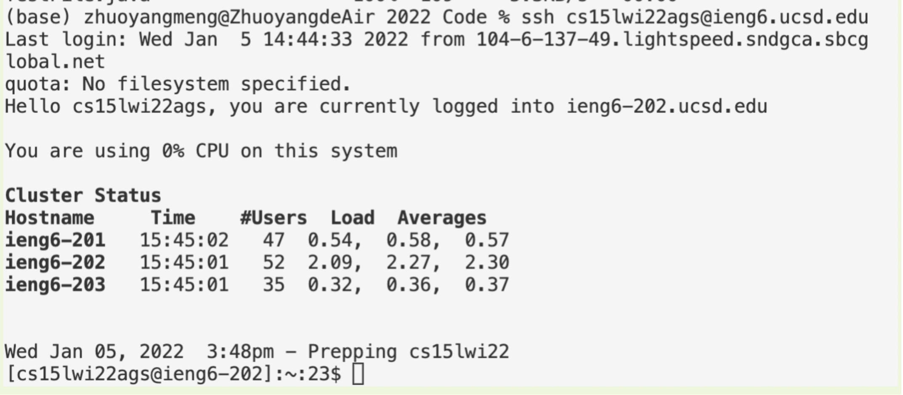

## Part 3: Run Some Commands
* First I ran `ls` to see what's in home directory

* Then I ran `cp TestFile.java Documents` to copy TestFile.java to the folder called Documents

* Next I ran `cd Documents` to change the working directory 

* I ran `ls` to confirm that TestFile.java was sucessfully copied

* Finally I ran `cd ..` to go back to home directory 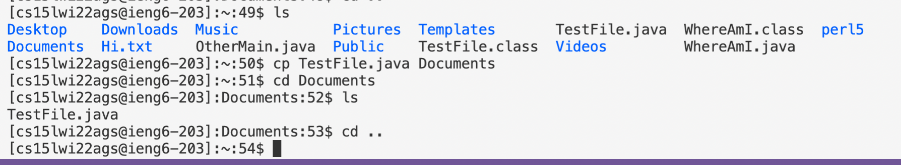 

## Part 4: Moving Files With Scp
* First I wrote WhereAmI.java File in VS Code 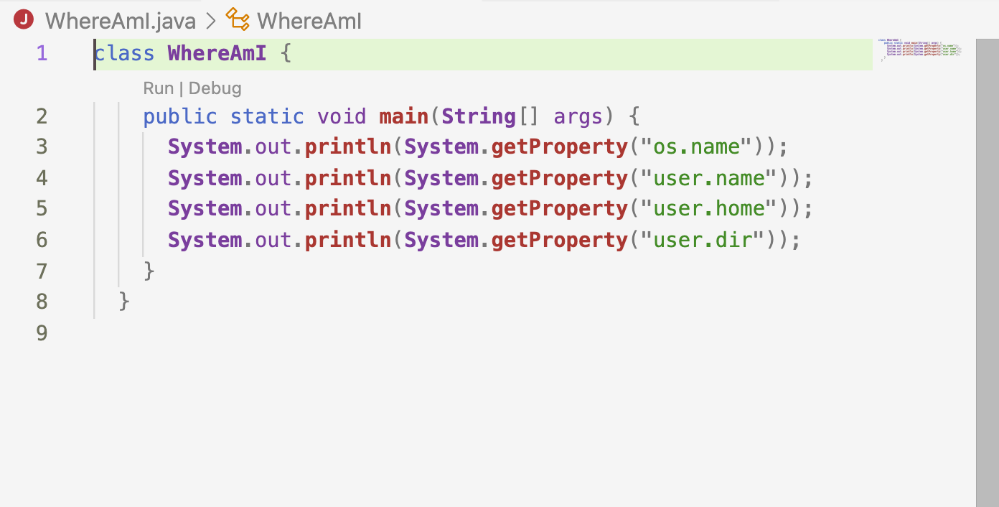

* Then I compiled and ran the file on VS Code and saw the following output 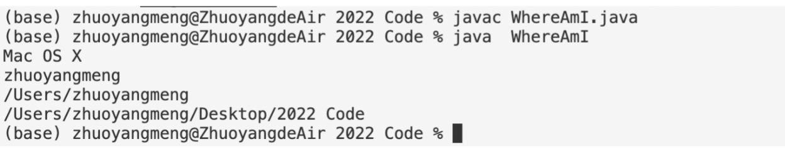

* Next I ran `scp WhereAmI.java cs15lwi22ags@ieng6.ucsd.edu:~/` to copy this file to the remote server

* Finally I compiled and ran the file on remote server and saw the following output 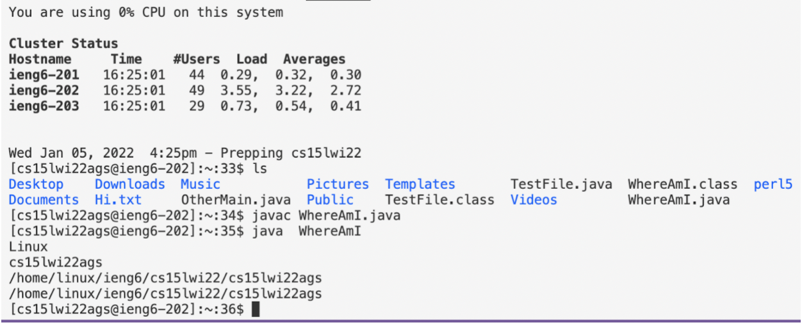

## Part 5: Set SSH Key
* I ran the following commands to set up an SSH Key 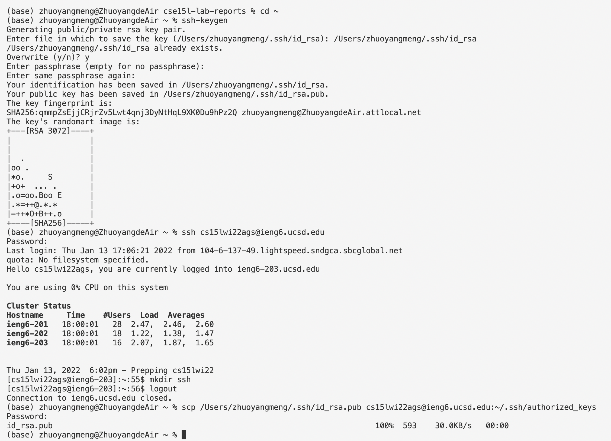

* After setting the ssh key, I was able to log in remote server without password 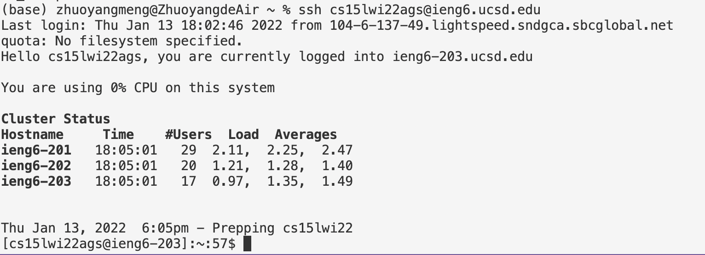

## Part 6: Optimizing Remote Running
* First I made some local edits to WhereAmI.java on VS code 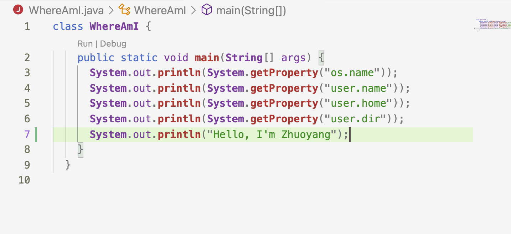

* Then I came out the following way to copy the file to remote server and run on it: 
  1. Use up-arrow key to get me to the command `scp WhereAmI.java cs15lwi22ags@ieng6.ucsd.edu:~/` and then run it , which takes me 4 keystrokes; 
  2. Use up-arrow key to get me to the command `ssh cs15lwi22ags@ieng6.ucsd.edu` , which takes me 2 keystrokes; 
  3. Copy-paste the following command: `javac WhereAmI.java;java WhereAmI` to the end of the previous command,  which takes me 2 keystrokes;
  4. Typing two `"` takes me 2 keystrokes;
  5. Clicking on return takes 1 extra keystroke. 

* Now I have 11 keystrokes in total. Originally, I had to type four commands and run them one by one, which took me more than 50 keystrokes. By using up-arrows and copy-pastes and combining commands, I can save a lot of keystrokes. Following are my optimized commands.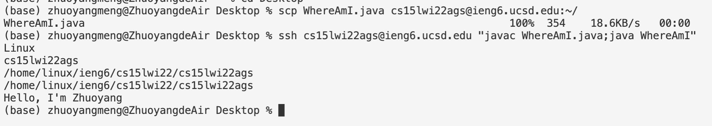

(Finished)

