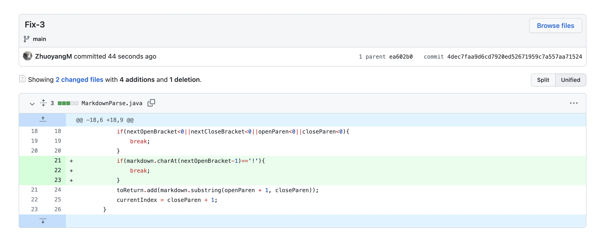

# Lab-Report-2-Week-4

## Code Change#1: Text After Link
- Fix: 

- Link: [test-file2](https://github.com/ZhuoyangM/markdown-parse/blob/3307b59946f694b6a2def45c3bde52d9aad15cbe/testfiles/test-file2.md)

- Symptom: Infinite loop. 

- Relationships: The failure inducing input for this file is the text after the link, which causes a bug in the original MarkdownParse file such that currentIndex never reaches the end of the markdown file and finally leads to the symptom such that the program stucks in an infinite loop. 

## Code Change#2: Missing Closing Paranthesis
- Fix: 

- Link: [test-file3](https://github.com/ZhuoyangM/markdown-parse/blob/dcd6e3e5f8b63e9cd02580bdb510bb103d0915fc/test-file3.md)

- Symptom: indexOutOfBoundException 

- Relationships: The failure inducing input for this file is the incomplete expression for a markdown link, where there's a missing closing parenthesis. This causes the bug in our current java code such that closeParen is updated to -1, which leads to the symptom of indexOutOfBoundException.

## Code Change#3: Image Link in File
- Fix: 

- Link: [test-file9](https://github.com/ZhuoyangM/markdown-parse/blob/ea602b0ecb8ee4aa871e9e86208cf6a521faf1b7/test-file9.md)

- Symptom: Wrong output 

- Relationships: The failure inducing input for this file is the image link in the file, which should not be collected. This causes the bug in our code such that it doesn't check whether the link is the image link or not and just parses it instead, which leads to the symptom such that the image link is output as well.