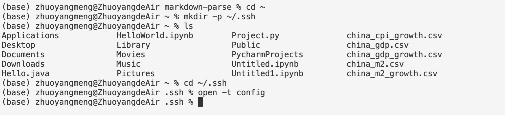
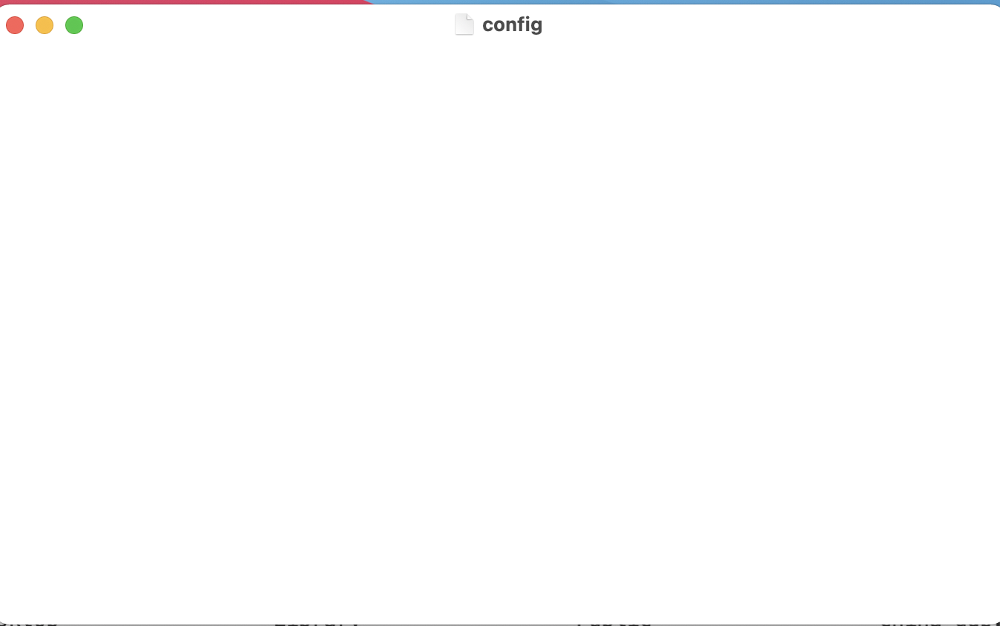
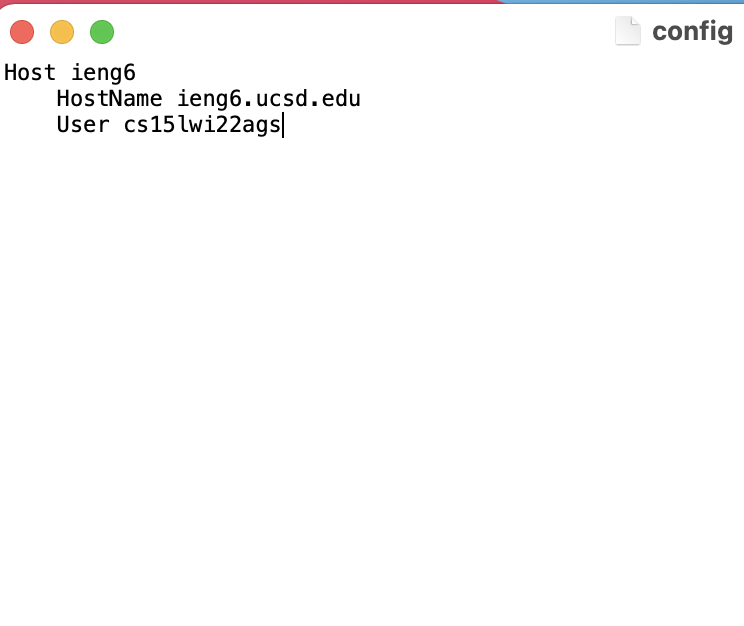
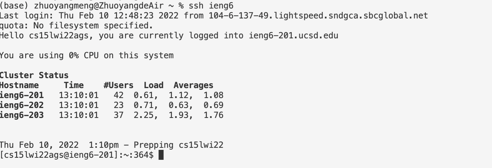
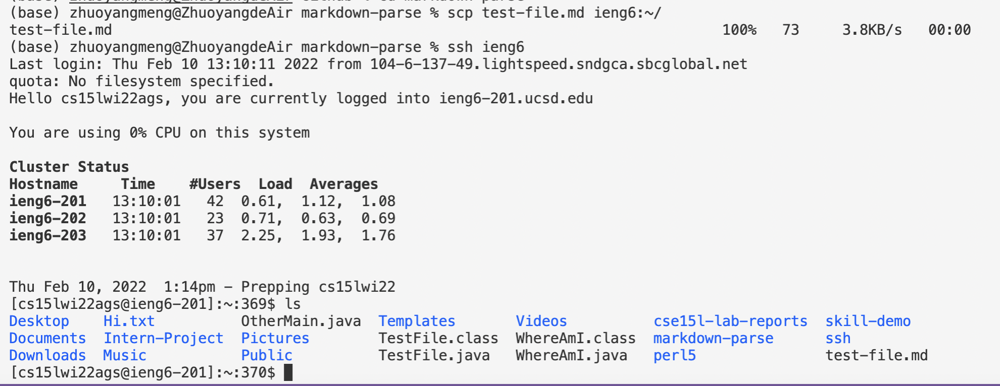

# Lab-Report-3-Week-6

## Streamlining SSH Configuration

## Step1: Create and Edit `.ssh/config`
- Create `.ssh/config` first 

- Open the file using TextEditor

- Add the lines to `.ssh/config` to customize server username and save it 

## Step2: Log into server using the alias `ieng6`
- Easier Login 

## Step3: Copy a file to server using the alias `ieng6`
- Copy `test-file.md` in directory `markdown-parse` to server using the alias `ieng6` 

- We can see that `test-file.md` is now in home directory of ieng6 from the picture above