# Lab-Report-4-Week-8

## Test Snippet1
- Expected Output
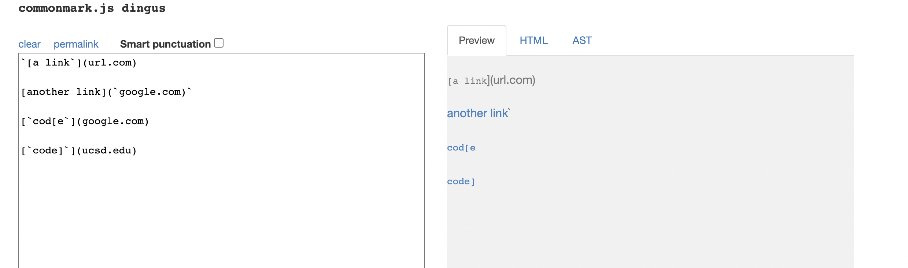

- Code For Junit Test
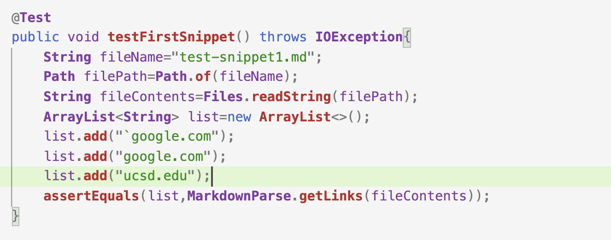

- My Implementation Output
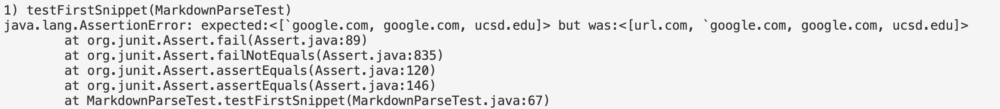

- Reviewed Implementation Output
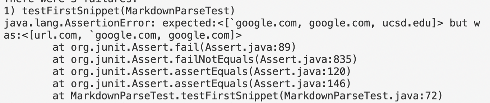

- Code Change Question\
Yes, I can just add an if statement to check if `[` is not at index 0 and if the previous character is a backtick. If that's the case, don't include that as a link.

## Test Snippet2
- Expected Output
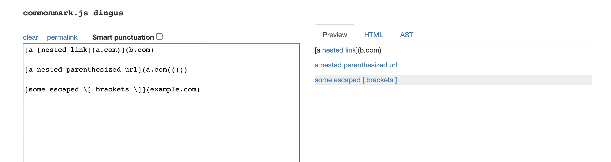

- Code For Junit Test
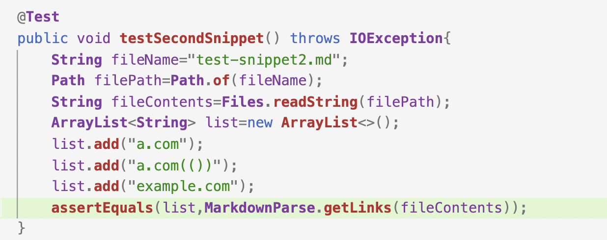

- My Implementation Output
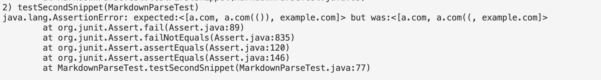

- Reviewed Implementation Output
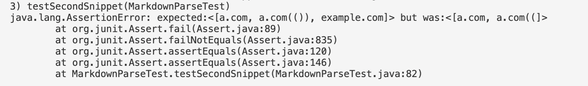

- Code Change Question\
Yes, it looks like my code works well for nested brackets and escape brackets. For nest parentheses, add an if statement to check if the character at index (closeParen+1) is still a close parenthesis. If so, increases closeParen by 1 until the next character is not close parenthesis anymore or it becomes the last character.

## Test Snippet3
- Expected Output
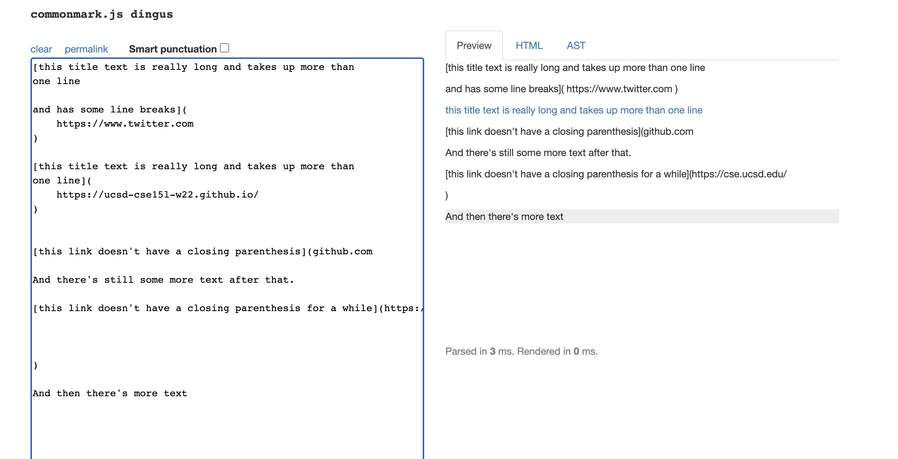

- Code For Junit Test
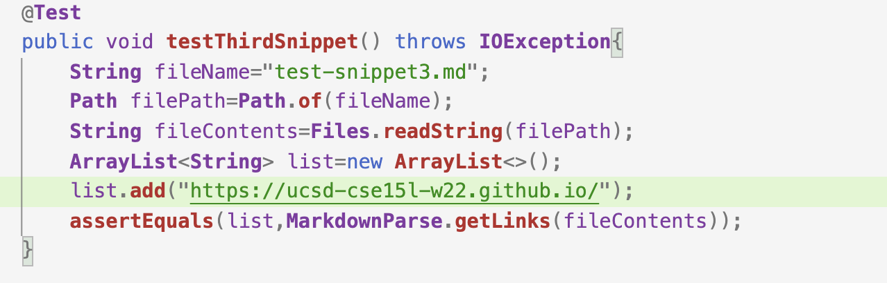

- My Implementation Output
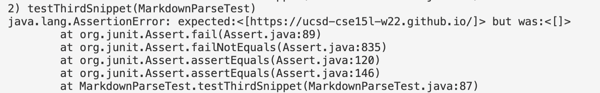

- Reviewed Implementation Output
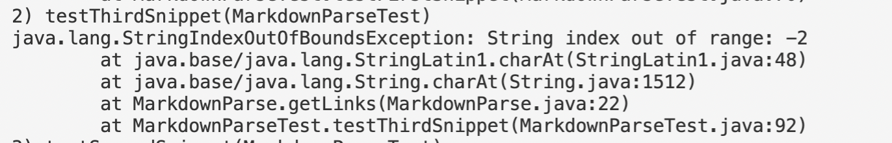

- Code Change Question\
Yes, according to my observation, if there's one empty line or more inside brackets or parentheses, it won't be given as a link. Thus, I just have to check if the parenthese or brackets contain one or more empty lines inside, if so just don't include that as a link. Besides, it's ok to have empty space inside parenthese, so delete the if statement for checking that.