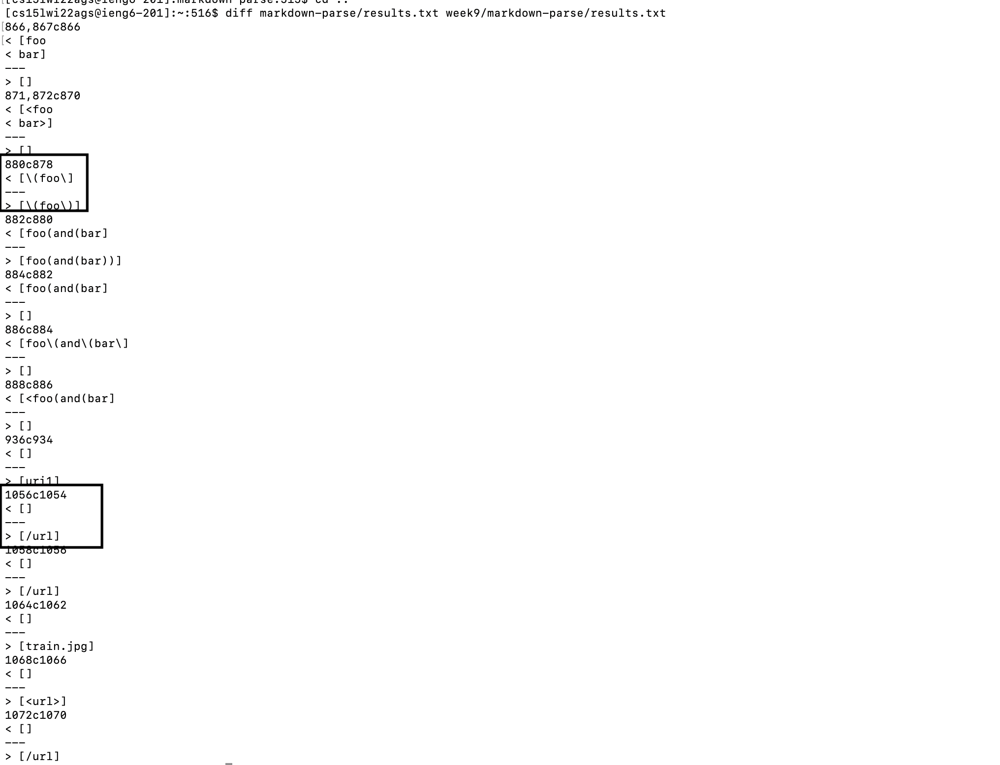
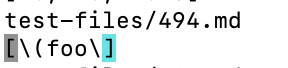
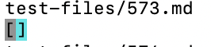
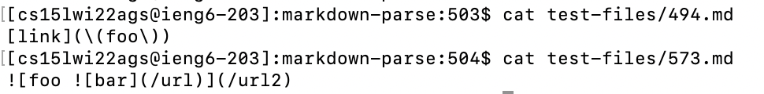
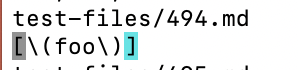
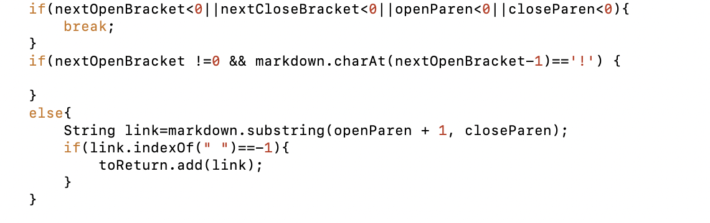
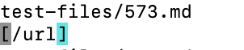
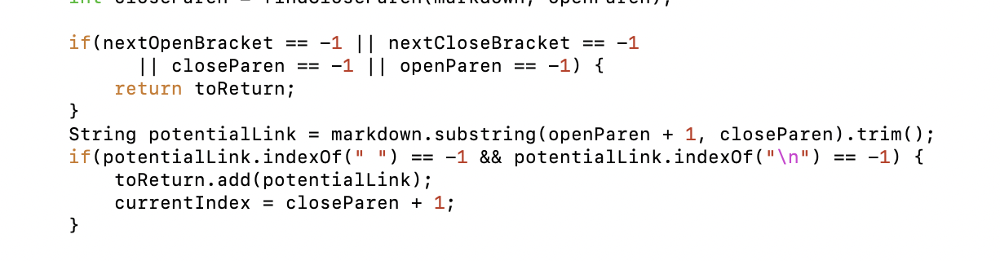

# Lab-Report-5-Week-10

## Find Different Results
- First I use `diff` command to find the tests with different outputs, and I choose 2 pairs of different outputs as marked in the picture below. 

- Next I use `vim` to check those 2 lines referred in above picture in my results.txt, and I find these 2 tests are, respectively, test-files/494.md and test-files/573.md.

## Test494
- First I use `cat` command to check the contents of test 494.

- From the contents of the tests, I think both my implementation and provided implementation fail.

- Actual outputs of my implementation

- Actual outputs of the provided implementation

- In 494.md, there's `\` before parentheses, and they shouldn't be printed, so the expected output is: `[(foo)]`

- For my implementation, the buggy code is shown below. Basically, my code doesn't differentiate between parentheses for links and parenthese characters. Specifically, it doesn't check whether there's `\` before parens. Since the url in 494.md includes parenthese characters, my implementation just treats one of them as the end of the url and thus fails.

## Test573
- First I use `cat` command to check the contents of test 573.

- From the contents of the tests, I think my implementation is correct, and the provided implementation fails. 

- Actual outputs of my implementation

- Actual outputs of the provided implementation

- The link in 573.md is an image link and shouldn't be included. Thus, the expected output is the output from my implementation: `[]`.

- For provided implementation, it doesn't differentiate between normal link and image link, which shouldn't be added to the output. Specifically, it doesn't check if there's `!` before `[`. The url in 573.md is a image link, the provided implementation includes it in output and thus fails.

