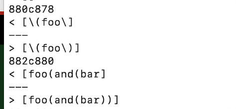
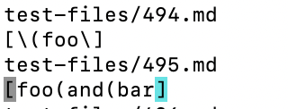
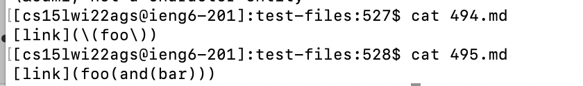
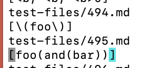
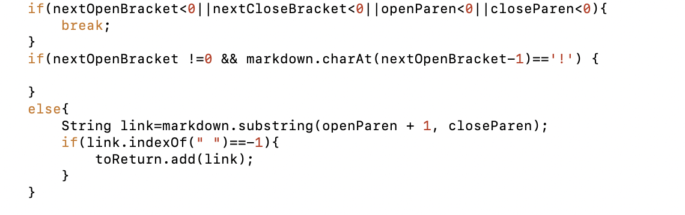

# Lab-Report-5-Week-10

## Find Different Results
- First I use `diff` command to find the tests with different results.

- Then I choose the following 2 differences

- Next I use `vim` to check the lines referred in the above picture and find that these 2 tests are, respectively, test-files/494.md and test-files/495.md.

## Bug Analysis
- First I use `cat` command to check the contents of test 494 and 495.

- From the contents of the tests, I think my implementation fails both tests, and the provided implementation is correct for both. 

- Actual outputs of my implementation

- Actual outputs of the provided implementation

- The expected outputs are those from the provided implementation

- For my implementation, the buggy code is shown below. Basically, my code didn't check whether the next close parenthesis ends an url or is just part of that url. For both test 494 and 495, the links in them have urls that include close parentheses. Therefore, for either of those tests, my code just treats the first close parenthesis it finds as the end of the url, but that parenthesis is actually part of the url and should be included in output. That's where the bug comes.

